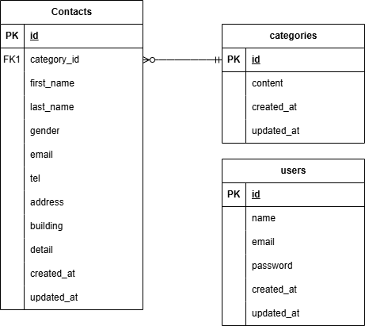

## アプリケーション名

ここにアプリの名前を記載

## 環境構築

1. Docker の設定
   下記コマンドを実行
   `docker-compose up -d --build`

2. Laravel のインストール
   下記コマンドを実行
   `docker-compose exec php bash`
   `composer install`

3. .env ファイルの作成
   下記コマンドを実行
   `cp .env.example .env`
   `exit`
   VSCode で.env ファイル 11 行目以降を下記に修正
   .env ファイル
   DB_CONNECTION=mysql
   DB_HOST=mysql
   DB_PORT=3306
   DB_DATABASE=laravel_db
   DB_USERNAME=[ユーザー名]
   DB_PASSWORD=[パスワード]

## ER 図

