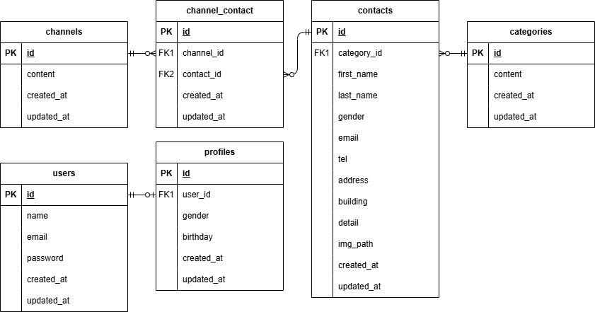

## アプリケーション名

ここにアプリの名前を記載

## 環境構築

1. Docker の設定
   下記コマンドを実行
    
   `docker-compose up -d --build`

2. Laravel のインストール
   下記コマンドを実行
    
   `docker-compose exec php bash`
   `composer install`

3. .env ファイルの作成
   下記コマンドを実行
    
   `cp .env.example .env`
    
   `exit`
    
   VSCode で.env ファイル 11 行目以降を下記に修正
    
   .env ファイル
    
   `DB_CONNECTION=mysql`
    
   `DB_HOST=mysql`
    
   `DB_PORT=3306`
    
   `DB_DATABASE=laravel_db`
    
   `DB_USERNAME=[ユーザー名]`
   `DB_PASSWORD=[パスワード]`

## ER 図

